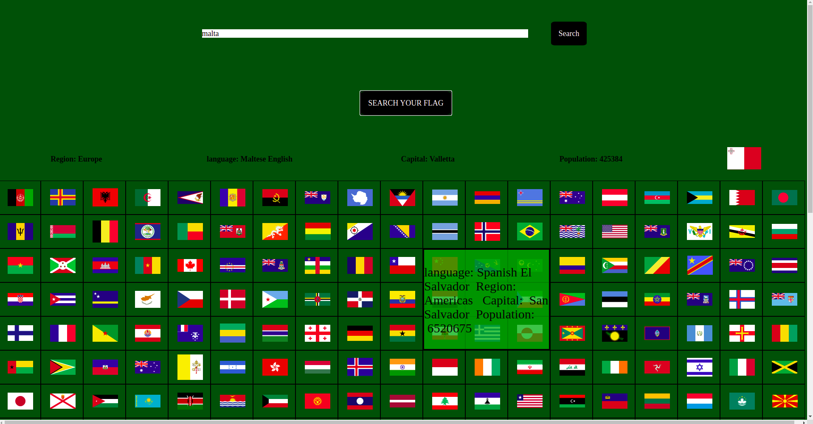

  

  <strong> find-the-flag </strong>
a React application that shows a list of every flag that exists til today together with some information about the country made by using API's with axios
<!-- examples of useState useEffect and useRef :
 -->
     
    <a href="https://github.com/AngelosPa/toDoList-ReactVersion/tree/main/mytodolist"><strong>Explore the files »</strong></a>
     
     
    <a href="https://angelospa.github.io/find-the-flag/">View Demo</a>
    ·
    <a href="https://github.com/github_username/repo_name/issues">Report Bug</a>
    ·
    <a href="https://github.com/github_username/repo_name/issues">Request Feature</a>
  

